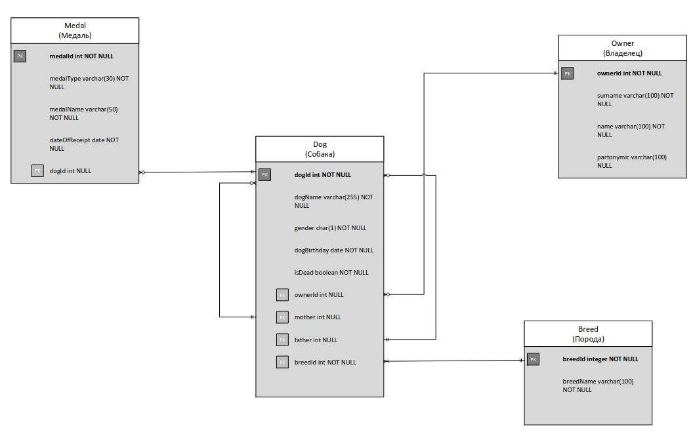

### Physical schema database for dog kernel:

### Scripts:
- database-structure.sql - script for create structure database by physical schema;
- alter-data.sql - script for show alter table operation's over column's table

